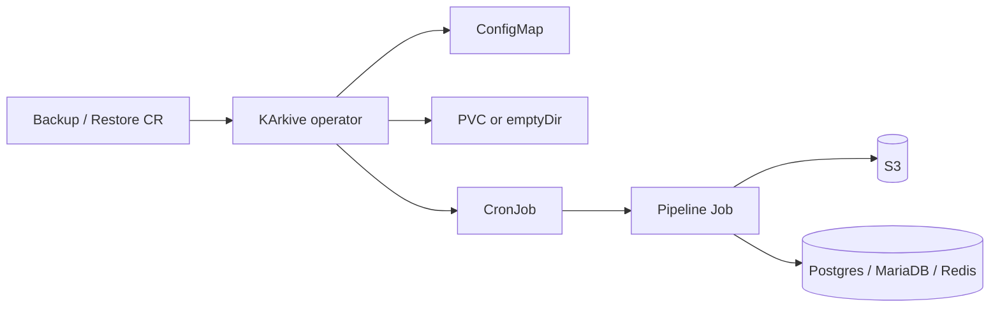

# KArkive

[](https://github.com/mahdidarabi/KArkive/actions/workflows/ci.yaml)
[](https://github.com/mahdidarabi/KArkive/pkgs/container/charts%2Fkarkive)
[](https://github.com/mahdidarabi/KArkive/pkgs/container/karkive)
[](https://go.dev/)
[](https://github.com/mahdidarabi/KArkive/tree/main/api/v1alpha1)

Kubernetes operator for **scheduled logical backups and restores**. You declare a `Backup` or `Restore` CR; KArkive owns a ConfigMap, optional PVC, and CronJob that dump, gzip, GPG-encrypt, and sync to S3 (and the reverse).

**Engines:** PostgreSQL · MariaDB · Redis

The operator never creates Secrets. It only reads `spec.secretRef` (and the engine-specific restore secret) from the same namespace as the CR.

```text
kubectl get backups,restores
# short names: kbackup / krestore
```

---

## Contents

- [How it works](#how-it-works)
- [Install](#install)
- [Backup](#backup)
- [Restore](#restore)
- [Secrets](#secrets)
- [Status](#status)
- [Monitoring](#monitoring)
- [Webhooks](#webhooks)
- [Configuration](#configuration)
- [Development](#development)
- [Layout](#layout)

## How it works

A CR named `app-postgres` is reconciled into owned resources prefixed `karkive-<cr-name>`:

| Resource | Name | Notes |
| --- | --- | --- |
| ConfigMap | `karkive-app-postgres` | Embedded pipeline scripts |
| PVC | `karkive-app-postgres` | Skip with `spec.persistence.enabled: false` (emptyDir) |
| CronJob | `karkive-app-postgres` | One Job per schedule (or `kubectl create job --from=…`) |



### Backup pipeline

`cleanup` → dump → `compress` → `encrypt` → `s3-sync`

### Restore pipeline

`cleanup` → `fetch` → `decrypt` → `extract` → restore

| Engine | Dump | Restore |
| --- | --- | --- |
| `postgres` | `pg_dump` | `pgrestore` |
| `mariadb` | `mysqldump` | `mysqlrestore` |
| `redis` | `redis-cli --rdb` | load RDB locally, `MIGRATE` keys |

Shared stages use BusyBox (`find` / `gzip`), `vladgh/gpg`, and MinIO `mc`. Engine images default to CloudNativePG PostgreSQL 18.4, MariaDB 10.6, and Redis 7.4.

Redis restore runs `FLUSHALL` on the target when `spec.dropDatabaseIfExists` is true (the default).

## Install

Images are published to `ghcr.io/mahdidarabi/karkive` from GitHub Actions on `main` (`latest`, `main`, `sha-<git-sha>`) and on tags `v*` (semver). Helm charts are pushed to GHCR on tags `v*`. `Chart.yaml` `version` and `appVersion` must match the tag without the `v` prefix.

Current release: **`0.0.1`**

```bash
helm show chart oci://ghcr.io/mahdidarabi/charts/karkive --version 0.0.1

helm install karkive oci://ghcr.io/mahdidarabi/charts/karkive \
  --version 0.0.1 \
  -n karkive-system --create-namespace
```

With Prometheus Operator scrape, alerts, and a Grafana dashboard ConfigMap:

```bash
helm install karkive oci://ghcr.io/mahdidarabi/charts/karkive \
  --version 0.0.1 \
  -n karkive-system --create-namespace \
  --set metrics.serviceMonitor.enabled=true \
  --set metrics.prometheusRule.enabled=true \
  --set metrics.grafanaDashboard.enabled=true
```

On GitOps (Argo CD), prefer cert-manager for webhook serving certs so Helm does not regenerate a CA on every template:

```bash
helm install karkive oci://ghcr.io/mahdidarabi/charts/karkive \
  --version 0.0.1 \
  -n karkive-system --create-namespace \
  --set webhook.certManager.enabled=true
```

cert-manager must already be installed. If you previously used the Helm-generated Secret, delete it once so cert-manager can create it.

## Backup

```yaml
apiVersion: karkive.io/v1alpha1
kind: Backup
metadata:
  name: app-postgres
  namespace: backup
spec:
  engine: postgres          # postgres | mariadb | redis
  schedule: "0 2 * * *"
  database:
    host: postgres.example.svc.cluster.local
    port: 5432              # defaults: 5432 / 3306 / 6379
    name: app
  s3:
    endpoint: https://s3.example.com
    bucket: backups
    path: app/pgdump
    retentionDays: 14       # S3 object retention (default 14)
  secretRef:
    name: backup-app-postgres
  persistence:
    enabled: true           # false → emptyDir
    size: 1Gi
    storageClassName: standard
  localRetentionDays: 7     # encrypted dumps kept on the PVC
```

MariaDB and Redis samples live under [`examples/`](examples/) (`backup-mariadb.yaml`, `backup-redis.yaml`).

Useful knobs:

| Field | Default | Purpose |
| --- | --- | --- |
| `spec.suspend` | `false` | Stop the schedule; CronJob remains for manual Jobs |
| `spec.job.concurrencyPolicy` | `Forbid` | CronJob concurrency |
| `spec.job.backoffLimit` | `3` | Job retries |
| `spec.job.ttlSecondsAfterFinished` | `86400` | Cleanup finished Jobs |
| `spec.images` | operator defaults | Override busybox / gpg / engine / mc images |
| `spec.resources` | — | Per-stage CPU/memory (`cleanup`, `dump`, `compress`, `encrypt`, `s3Sync`) |
| `spec.component` | CR name | `app.kubernetes.io/component` label |

Trigger a run without waiting for cron:

```bash
kubectl create job --from=cronjob/karkive-app-postgres app-postgres-manual -n backup
```

## Restore

Restore `secretRef` is S3 + GPG only. Target database credentials come from `spec.postgresSecret`, `spec.mariadbSecret`, or `spec.redisSecret`.

```yaml
apiVersion: karkive.io/v1alpha1
kind: Restore
metadata:
  name: app-postgres
  namespace: backup
spec:
  engine: postgres
  schedule: "30 2 * * *"
  suspend: true             # typical: run on demand
  database:
    host: postgres.example.svc.cluster.local
    port: 5432
    name: app
    ownerRole: app
  s3:
    endpoint: https://s3.example.com
    bucket: backups
    path: app/pgdump
  secretRef:
    name: restore-app-postgres
  postgresSecret:
    name: postgres
    usernameKey: username
    passwordKey: password
  persistence:
    enabled: false
    size: 2Gi
  useLatestBackupAsFallback: true
  dropDatabaseIfExists: true
  stripPgAuditExtension: true
```

| Field | Default | Purpose |
| --- | --- | --- |
| `spec.backupFile` | empty | Specific S3 object name |
| `spec.useLatestBackupAsFallback` | `true` | Newest dump matching the engine prefix when `backupFile` is empty or missing |
| `spec.dropDatabaseIfExists` | `true` | Drop a non-empty target first (`FLUSHALL` on Redis) |
| `spec.stripPgAuditExtension` | `true` | Strip pgAudit DDL from Postgres dumps |
| `spec.job.restartPolicy` | `Never` | Restore Jobs do not restart in-place |
| `spec.job.backoffLimit` | `1` | Fail fast |

## Secrets

The operator does not create or mutate Secrets. Apply them yourself in the CR namespace.

**Backup** (`spec.secretRef`) needs:

| Key | Used for |
| --- | --- |
| `username` | DB user (Redis ACL user; `default` if unused) |
| `password` | DB password |
| `s3_access_key` | S3 |
| `s3_secret_key` | S3 |
| `gpg_passphrase` | Symmetric encryption of the dump |

**Restore** splits credentials:

| Source | Keys |
| --- | --- |
| `spec.secretRef` | `s3_access_key`, `s3_secret_key`, `gpg_passphrase` |
| `spec.postgresSecret` / `mariadbSecret` / `redisSecret` | `username` / `password` by default (`usernameKey` / `passwordKey` override) |

```yaml
apiVersion: v1
kind: Secret
metadata:
  name: backup-app-postgres
  namespace: backup
type: Opaque
stringData:
  username: app
  password: change-me
  s3_access_key: change-me
  s3_secret_key: change-me
  gpg_passphrase: change-me
```

See [`config/samples/backup-secret.yaml`](config/samples/backup-secret.yaml).

## Status

Phases: `Pending` · `Ready` · `Error` · `Unsupported`.

Status copies CronJob schedule/success times and the last finished Job:

```yaml
status:
  phase: Ready
  cronJobName: karkive-app-postgres
  lastScheduleTime: "2026-08-20T02:00:00Z"
  lastSuccessfulTime: "2026-08-20T02:04:12Z"
  lastJob:
    name: karkive-app-postgres-29781240
    outcome: Succeeded   # or Failed
    reason: DeadlineExceeded
    message: "Job was active longer than specified deadline"
```

```bash
kubectl get kbackup,krestore -A
kubectl describe backup app-postgres -n backup
```

Print columns include engine, schedule, phase, last success (Backup), and last Job outcome.

## Monitoring

The chart exposes `/metrics` on a ClusterIP Service (`:8080`) and `/healthz` + `/readyz` on `:8081`.

Custom series are labeled `namespace`, `name`, `engine`:

| Metric | Meaning |
| --- | --- |
| `karkive_backup_ready` / `karkive_restore_ready` | `1` when phase is `Ready` |
| `karkive_backup_suspended` / `karkive_restore_suspended` | `spec.suspend` |
| `karkive_backup_last_successful_timestamp_seconds` | Last successful Job |
| `karkive_backup_last_job_failed` | Last finished Job failed |
| `karkive_backup_last_job_duration_seconds` | Wall time of last Job |
| `karkive_backup_last_job_info` | Always `1`; labels `outcome`, `reason`, `job_name` |

Alerts (when `metrics.prometheusRule.enabled=true`):

- CR not Ready for 15m
- Last Job failed
- No successful backup within `backupStaleSeconds` (default 36h) on non-suspended Backups
- Missed CronJob schedule via kube-state-metrics (`karkive-*`)

## Webhooks

Validating admission webhooks reject invalid `Backup` / `Restore` specs (cron schedule, required fields, engine-specific restore secrets). They are **on** in the Helm chart and **off** for `make run`.

Serving certs default to Helm `genCA`. That Secret changes on every template, which fights GitOps. Set `webhook.certManager.enabled=true` instead.

## Configuration

Operator-wide defaults (Helm `values.yaml` → flags):

| Helm | Flag | Default |
| --- | --- | --- |
| `watchNamespace` | `WATCH_NAMESPACE` | all namespaces |
| `leaderElection` | `--leader-elect` | `true` in the chart |
| `defaults.busyboxImage` | `--busybox-image` | `busybox:1.37` |
| `defaults.gnupgImage` | `--gnupg-image` | `vladgh/gpg:1.3.11` |
| `defaults.postgresImage` | `--postgres-image` | `cloudnative-pg/postgresql:18.4` |
| `defaults.mariadbImage` | `--mariadb-image` | `mariadb:10.6` |
| `defaults.redisImage` | `--redis-image` | `redis:7.4` |
| `defaults.mcImage` | `--mc-image` | `minio/mc:RELEASE.2025-08-13T08-35-41Z` |
| `defaults.s3.endpoint` | `--default-s3-endpoint` | empty (required on the CR unless set) |
| `defaults.s3.bucket` | `--default-s3-bucket` | empty |

Per-CR `spec.s3.endpoint` / `spec.s3.bucket` override the operator defaults. `spec.s3.path` is always required.

## Development

Requires Go (see `go.mod`) and a kubeconfig.

```bash
make generate manifests test
make run                    # against the current cluster; webhooks off

kubectl apply -f config/crd/bases
kubectl apply -f config/samples/backup-secret.yaml
kubectl apply -f config/samples/karkive_v1alpha1_backup.yaml
```

| Target | What it does |
| --- | --- |
| `make generate` | Deepcopy for `api/` |
| `make manifests` | CRDs, RBAC, webhook manifests; copies CRDs into the Helm chart |
| `make test` | `go test ./...` |
| `make docker-build` | Operator image (`IMG`, default `ghcr.io/mahdidarabi/karkive:dev`) |
| `make install` / `uninstall` | Apply / delete CRDs |

CI on `main` and tags `v*` runs generate/vet/test (failing on dirty git), builds `linux/amd64`, and on tags pushes the Helm chart to `oci://ghcr.io/mahdidarabi/charts`.

## Layout

```text
api/v1alpha1/            Backup + Restore types (karkive.io)
cmd/                     Operator entrypoint
internal/
  controller/            Reconcile loops + last-Job status
  resources/             ConfigMap / PVC / CronJob builders
  pipeline/scripts/      Embedded shell stages
  metrics/               Prometheus collector
  config/                Operator-wide image / S3 defaults
  jobstatus/             Job Complete / Failed parsing
charts/karkive/          Helm chart (CRDs, RBAC, webhook, metrics)
config/crd/bases/        Generated CRDs
config/samples/          Example Backup / Restore / Secret
examples/                Postgres, MariaDB, Redis CRs
```
